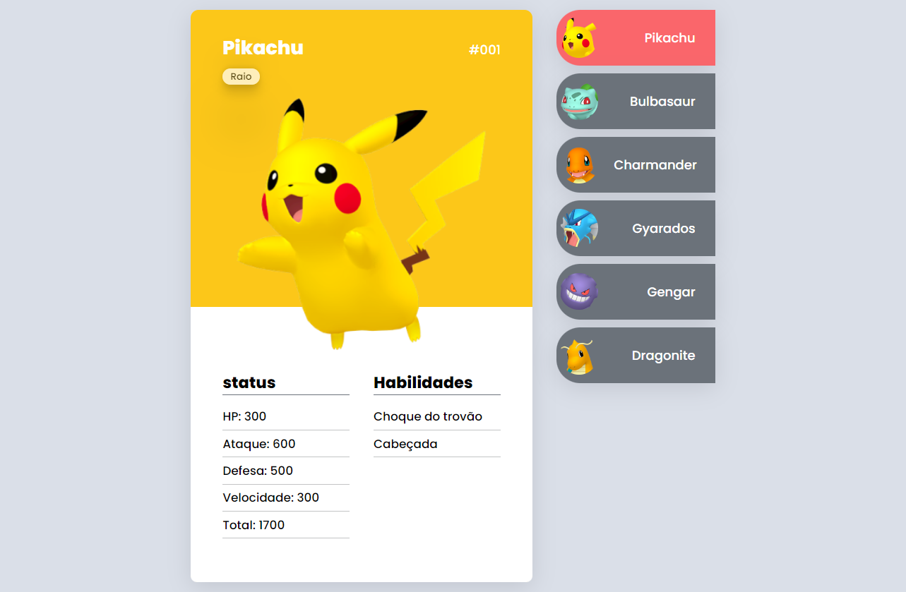

<h1 align="center">
 Pokedex! 
</h1>

  

  

## 📝 Descrição
Pokedex baseada no anime pokemon contendo informações de status e habilidades de alguns pokemons.

Projeto desenvolvido durante evento MapaDev Week do Dev em Dobro.

[Clique aqui para abrir o site](https://rennanpereira.github.io/Pokedex-project/)

## 🚀 Tecnologias

- HTML 5
- CSS 3
- JavaScript

---
## 💜 Contato
Email: rennanpereira.contato@gmail.com
Linkedin: https://www.linkedin.com/in/rennan-santos-pereira/